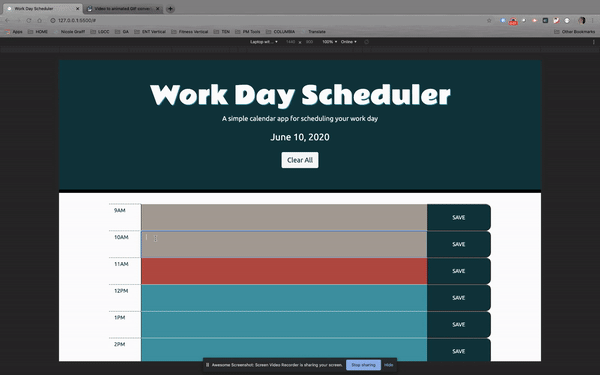

# Work Day Scheduler

Link to published page: https://keycole.github.io/work-day-scheduler/

## Purpose


A simple calendar application that allows the user to save events for each hour of the day.

Users can clear all contents by using the "Clear All" button.


## Built With


1. Bootstrap: https://getbootstrap.com/

1. Moment.js: https://momentjs.com/docs/

1. jQuery: https://jquery.com/

1. Google Fonts: https://fonts.google.com/

    - h1: Rammetto One

    - body: Ubuntu


    ```html
        <link href="https://fonts.googleapis.com/css2?family=Rammetto+One&family=Ubuntu&display=swap" rel="stylesheet">
    ````

1. Color Theme Found on Visme: _Turquoise and Red_ 

    https://visme.co/blog/color-combinations/
    - Past Event Color Code: 
        ```css
        color: #a79c93;
        ```

        

    - Current Event Color Code:
        ```css
        color: #c1403d;
        ```

        

    - Future Event Color Code:
        ```css
        color: #0294a5;
        ```

        

    - Header Color:
        ```css
        color: #03353e;
        ```

        


1. Favicon . io: https://favicon.io/emoji-favicons/timer-clock/


## Screenshots

**Desktop**





**Tablet**


**Mobile**


